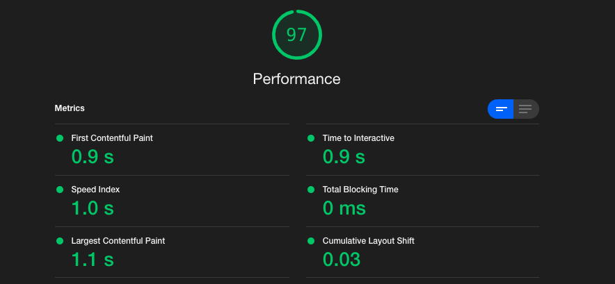

## Getting to Know Web Vitals

In a recent project, my NextJS with Material UI deployment has been loading the initial render slow. So I am learning the debugging process behind that performance lag, which has me getting to know the Web Vitals. And i thought I'd share what I've learned thus far with you.

I can gain access to the Web Vitals in a few different places, but currently I just want the value output so I'm using the `reportWebVitals` function that is inherit in NextJS and logging them out for quick access, for more detail and suggestions I run a [Lighthouse](https://developers.google.com/web/tools/lighthouse/) report.

### Web Vitals

In the simplest terms, Web vitals are useful metrics that help in the examination of the user experience of a webpage. They are an [initiative from Google](https://web.dev/vitals/), that hope to simplify and help focus evaluations to what matters most, these culminate into the **Core Web Values**.

### So what are the **Core Web Values**?

A subset of web vitals that can be applied to all web pages, should be examined and weight by site owners, and have a thread to all the Google tools. The subsets, each has a reference to a specific type of user experience. These references provide measurement and can reflect critical user-centric outcomes.

#### The Core Web Vitals:

- `LCP: Largest Contentful Paint`
- `FID: First Input Delay`
- `CLS: Cumulative Layout Shift`

#### The metrics I have access to:

- `TTFB: Time To First Byte`
  - This metric refers to the time it takes to receive the first byte of information after the browser request it.
- `FCP: First Contentful Paint`

  - The metric reflect the time to the first bit of content rendered to the DOM.
  - This is where a user can start consuming page content.

- **`LCP: Largest Contentful Paint`**

  - This metrics measures loading performance, for "Good UX", loading should take between 0 and 2.5 seconds.
  - Using the `reportWebVitals`, the value is represented in milliseconds

- **`FID: First Input Delay`**

  - A metric for measuring Load responsiveness, when this number is low the site is typically easier to use and navigate.
    - The perception of the end user's experience while interacting with the web page.
  - It help measure the time from when the user first interacts with the page to the time when the browser processes the interaction.
  - For "Good UX", that time should fall between 0 and 100 milliseconds

- **`CLS: Cumulative Layout Shift`**
  - A metric for measuring visual stability.
  - This measures the largest burst of layout shifts that are unexpected through out the life of a page.

#### Additional Next Specific Metrics:

- `Next.js-hydration`
  - This measures the length of time from start to finish, it takes a page to Hydrate in milliseconds.
  - What is Hydration?
    - The process of attaching react listeners to HTML-DOM nodes.
    - Rehydration is basically the same, but in reference to Server Side Rendered(SSR) rendered HTML. The listeners still need to be attached.
- `Next.js-route-change-to-render`
  - How long it takes a page to start rendering after a route change.
  - It is measured in Milliseconds.
- `Next.js-render`
  - How long it takes a page to finish rendering after a route change.
  - It is measured in Milliseconds.
